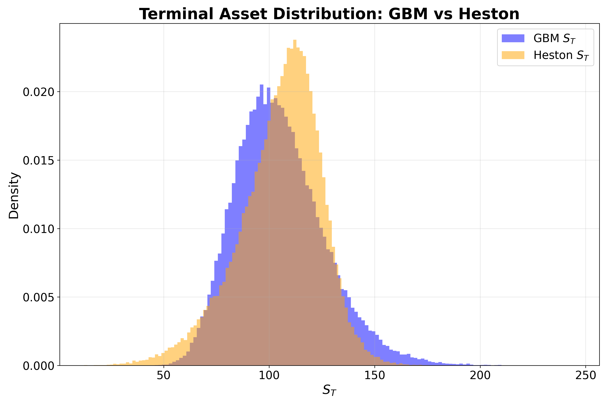

# Monte Carlo Option Pricing Framework

A Monte Carlo framework for pricing European and path-dependent derivatives under Black–Scholes and Heston dynamics, with variance reduction and convergence analysis.

---

## 📌 Features

### 🧮 Option Pricing
- **European Options:** Validated against analytical Black–Scholes benchmarks.
- **Asian Options:** Arithmetic path-dependent averaging.

### 📊 Monte Carlo Simulation
- **Geometric Brownian Motion (GBM):** Asset dynamics under the Black–Scholes model with constant volatility.
- **Heston Model:** Stochastic volatility with mean-reverting variance and correlated Brownian motions.
- **Flexible Engine:** Supports variable path counts ($N$) and time steps ($dt$).

### ⚙️ Variance Reduction
- **Control Variates:** Leveraging the correlation between European and Asian payoffs to stabilize estimators.

### 📈 Convergence Analysis
- Empirical verification consistent with $O(1/\sqrt{N})$ error decay.
- Automated visualization of confidence intervals.

---

## 🔬 Experimental Results

The following results were obtained with $N = 100,000$ paths and $100$ time steps ($S_0=100, K=100, T=1.0, r=0.05, \sigma=0.2$ for GBM; stochastic volatility parameters for Heston are held fixed across runs).

### 1. European Option Validation (GBM)

The Monte Carlo estimate is consistent with the analytical Black-Scholes price.

| Metric | Value |
| :--- | :--- |
| **MC Price** | 10.4231 |
| **Black-Scholes** | 10.4506 |
| **Relative Error** | 0.26% |
| **95% Confidence Interval** | [10.3323, 10.5139] |

### 2. Asian Option & Variance Reduction (GBM)

The **Control Variate** method significantly reduces estimator variance, producing a more stable price estimate.

| Method | Price Estimate | Standard Error | 95% Confidence Interval |
| :--- | :--- | :--- | :--- |
| **Standard MC** | 5.7360 | 0.0251 | [5.6869, 5.7851] |
| **Control Variate** | 5.7485 | 0.0135 | [5.7220, 5.7751] |

### 3. Model Comparison (GBM vs Heston)

To assess the impact of stochastic volatility, the same Monte Carlo framework is applied under both GBM and Heston dynamics.

| Model | European Option | Asian Option |
| :--- | :--- | :--- |
| **GBM (Black–Scholes)** | 10.3755 | 5.7227 |
| **Heston (Stochastic Volatility)** | 10.2561 | 5.6637 |
| **Black–Scholes Benchmark** | 10.4506 | — |

---

## 📉 Convergence Analysis

### European Path Stability
The plot shows Monte Carlo convergence toward the Black-Scholes benchmark as $N$ increases. The blue shaded region represents the narrowing 95% confidence interval.


### Variance Reduction Performance
This comparison highlights how the Control Variate (green) reaches a converged state faster than the Standard MC (red dashed).


### Terminal Asset Distribution (GBM vs. Heston)

The histogram illustrates the distribution of the terminal asset price $$S_T$$ under both models. The GBM model (blue) follows the expected log-normal shape, while the Heston model (orange) is more peaked, slightly right-shifted, and exhibits a heavier left tail.

This reflects the effect of stochastic volatility: mean-reverting variance concentrates mass near the center, while correlation and volatility fluctuations introduce asymmetry. These differences are parameter-dependent and can materially impact option pricing relative to constant-volatility assumptions.



---

## 🧠 Mathematical Model

### Risk-Neutral Pricing Framework

All derivatives are priced via:

$$
V = e^{-rT}\mathbb{E}^{\mathbb{Q}}[\text{payoff}(S_T)]
$$

---

### Stochastic Models

#### GBM (Black–Scholes Model)

Continuous dynamics:
$$
dS_t = r S_t dt + \sigma S_t dW_t
$$

---

#### Heston Model

Asset dynamics:
$$
dS_t = r S_t dt + \sqrt{v_t}\, S_t dW_t^S
$$

Variance process:
$$
dv_t = \kappa(\theta - v_t)dt + \xi \sqrt{v_t}\, dW_t^v
$$

Correlation:
$$
dW_t^S \, dW_t^v = \rho \, dt
$$

---

### Numerical Simulation (Discretization)

#### GBM (Exact Simulation Scheme)

$$
S_{t+\Delta t} = S_t \exp\left(\left(r - \frac{1}{2}\sigma^2\right)\Delta t + \sigma \sqrt{\Delta t} Z\right)
$$

---

#### Heston (Euler–Maruyama Scheme)

Variance update:
$$v_{t+\Delta t} =
\max\left(
v_t + \kappa(\theta - v_t)\Delta t + \xi \sqrt{v_t \Delta t}\, Z_2,
\,0
\right)
$$

Asset update:
$$
S_{t+\Delta t} =
S_t \exp\left(\left(r - \frac{1}{2}v_t\right)\Delta t + \sqrt{v_t \Delta t} Z_1\right)
$$

Correlated shocks:
$$
Z_2 = \rho Z_1 + \sqrt{1 - \rho^2}\, Z^\perp
$$

---

## 📁 Project Structure

```text
mc_option_pricer/
│
├── models/
│   ├── monte_carlo.py        # GBM simulation engine
│   ├── black_scholes.py      # Analytical benchmark
│   ├── heston.py             # Heston volatility
│   └── variance_reduction.py # Control variates implementation
├── options/
│   ├── european.py           # European payoff logic
│   └── asian.py              # Path-dependent payoff logic
├── utils/
│   └── statistics.py         # CI and error metrics
├── figures/                  # Generated convergence plots
└── main.py                   # Experiment runner
```
---

## 🚀 Installation & Usage

### 🛠 Installation

1. **Clone the repository:**
   ```bash
   git clone https://github.com/ngp66/mc-option-pricing.git
   ```

2. Create a virtual environment (recommended)
    ```bash
    python -m venv venv
    source venv/bin/activate   # macOS/Linux
    venv\Scripts\activate      # Windows
    ```

3. Install dependencies:
   The project requires Python 3.8+ and the following scientific libraries:
   ```bash
   pip install numpy scipy matplotlib
   ```

### 💻 Usage
   Run the main simulation script to execute the pricing engine and perform the convergence study:
   ```bash
   python main.py
   ```

The script will:

- Compute Prices: Output statistical summaries (Mean, StdErr, 95% CI) for European and Asian options directly to the console.

- Generate Plots: Create and save high-resolution convergence charts in the figures/ directory.
