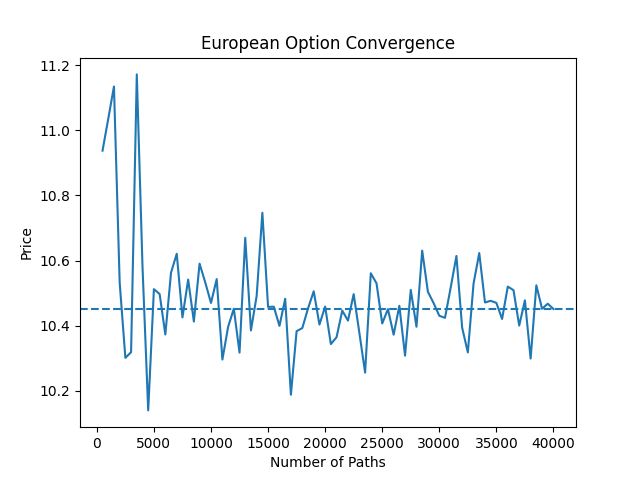
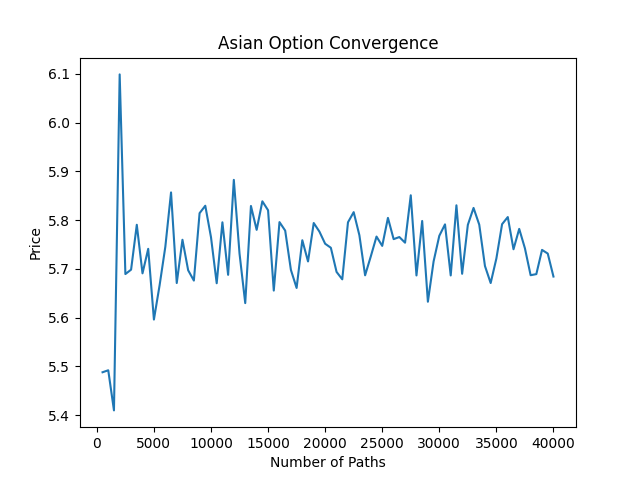

# Monte Carlo Option Pricing Framework

A Python Monte Carlo simulation framework for pricing European and path-dependent options, with variance reduction techniques and statistical validation tools.

The project is designed to demonstrate numerical methods used in quantitative finance, including stochastic simulation, derivative pricing, and Monte Carlo convergence analysis.

---

## 📌 Features

### 🧮 Option Pricing
- **European Options:** Validated against analytical Black–Scholes benchmarks.
- **Asian Options:** Arithmetic path-dependent averaging.

### 📊 Monte Carlo Simulation
- **Geometric Brownian Motion (GBM):** Optimized vectorized path generation.
- **Flexible Engine:** Supports variable path counts ($N$) and time steps ($dt$).

### ⚙️ Variance Reduction
- **Control Variates:** Leveraging the correlation between European and Asian payoffs to stabilize estimators.

### 📈 Convergence Analysis
- Empirical verification of $O(1/\sqrt{N})$ error decay.
- Automated visualization of confidence interval "funnels."

---

## 🔬 Experimental Results

The following results were obtained with $N = 100,000$ paths and $100$ time steps ($S_0=100, K=100, T=1.0, r=0.05, \sigma=0.2$).

### 1. European Option Validation
The Monte Carlo estimate is highly consistent with the analytical Black-Scholes price.

| Metric | Value |
| :--- | :--- |
| **MC Price** | 10.4231 |
| **Black-Scholes** | 10.4506 |
| **Relative Error** | 0.26% |
| **95% Confidence Interval** | [10.3323, 10.5139] |

### 2. Asian Option & Variance Reduction
The **Control Variate** method significantly reduces the estimator's variance, providing a much more stable price with half the standard error of the standard approach.

| Method | Price Estimate | Standard Error | 95% Confidence Interval |
| :--- | :--- | :--- | :--- |
| **Standard MC** | 5.7360 | 0.0251 | [5.6869, 5.7851] |
| **Control Variate** | 5.7485 | 0.0135 | [5.7220, 5.7751] |

---

## 📉 Convergence Analysis

### European Path Stability
The plot below shows the MC estimate converging toward the Black-Scholes benchmark. The blue shaded region represents the narrowing 95% confidence interval as $N$ increases.



### Variance Reduction Performance
This comparison highlights how the Control Variate (Green) reaches a converged state much faster and with significantly less "jitter" than the Standard MC (Red dashed).



---

## 🧠 Mathematical Model

Asset dynamics under risk-neutral measure:
$$dS_t = r S_t dt + \sigma S_t dW_t$$

Exact discretization for simulation:
$$S_{t+\Delta t} = S_t \exp\left((r - \frac{1}{2}\sigma^2)\Delta t + \sigma \sqrt{\Delta t} Z\right)$$

Risk-neutral pricing:
$$V = e^{-rT} \mathbb{E}[\text{payoff}]$$

---

## 📁 Project Structure

```text
mc_option_pricer/
│
├── models/
│   ├── monte_carlo.py        # GBM simulation engine
│   ├── black_scholes.py      # Analytical benchmark
│   └── variance_reduction.py # Control variates implementation
├── options/
│   ├── european.py           # European payoff logic
│   └── asian.py              # Path-dependent payoff logic
├── utils/
│   └── statistics.py         # CI and error metrics
├── figures/                  # Generated convergence plots
└── main.py                   # Experiment runner

---

## 🚀 Installation & Usage

### 🛠 Installation

1. **Clone the repository:**
   ```bash
   git clone [https://github.com/ngp66/mc-option-pricing.git](https://github.com/ngp66/mc-option-pricing.git)
   cd mc-option-pricing

2. Create a virtual environment (recommended)
    python -m venv venv
    source venv/bin/activate   # macOS/Linux
    venv\Scripts\activate      # Windows

3. Install dependencies:
   The project requires Python 3.8+ and the following scientific libraries:
   ```bash
   pip install numpy scipy matplotlib

### 💻 Usage
   Run the main simulation script to execute the pricing engine and perform the convergence study:
   ```bash
   python main.py

The script will:

Compute Prices: Output statistical summaries (Mean, StdErr, 95% CI) for European and Asian options directly to the console.

Generate Plots: Create and save high-resolution convergence charts in the figures/ directory.
